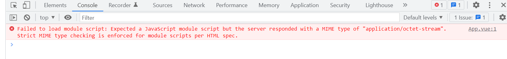

# vite源码学习

```
序篇介绍：
本项目主要是仓库从零手写一个类似vite1.x的脚手架，其主旨主要是理解vite的来龙去脉，彻底掌握vite；
```

## 一、单体仓库与多仓库的认知

### 1.1 单体仓库（`monoRepo`）和多仓库（multiRepo）的区别？

- monoRepo是将所有的模块统一的放在一个主干分支之中管理 (即一个仓库里面放很多个包)
- multiRepo 将项目分化成为多个模块，并针对每一个模块单独的开辟一个Repo来进行管理 (即每个仓库里面放一个包)

### 1.1.1 多仓库（multiRepo）

​	多仓库为我们带来的好处如下↓

1. 每一个服务都有一个独立的仓库，职责单一。
2. 代码量和复杂性受控，服务由不同的团队独立维护、边界清晰。
3. 单个服务也易于自治开发测试部署和扩展，不需要集中管理集中协调。
4. 利于进行权限控制，可以针对单个仓库来分配权限，权限分配粒度比较细。

但同时，多仓库也存在一下的问题：

1. 项目代码不容易规范。每个团队容易各自为政，随意引入依赖，code review 无法集中开展，代码风格各不相同。
2. 项目集成和部署会比较麻烦。虽然每个项目服务易于集成和部署，但是整个应用集成和部署的时候由于仓库分散就需要集中的管理和协调。
3. 开发人员缺乏对整个项目的整体认知。开发人员一般只关心自己的服务代码，看不到项目整体，造成缺乏对项目整体架构和业务目标整体性的理解。
4. 项目间冗余代码多。每个服务一个服务一个仓库，势必造成团队在开发的时候走捷径，不断地重复造轮子而不是去优先重用其他团队开发的代码。

### 1.1.2单仓库

​	单体仓库的优势：

1. 易于规范代码。所有的代码在一个仓库当中就可以标准化依赖管理，集中开展 code review，规范化代码的风格。
2. 易于集成和部署。所有的代码在一个仓库里面，配合自动化构建工具，可以做到一键构建、一键部署，一般不需要特别的集中管理和协调。
3. 易于理解项目整体。开发人员可以把整个项目加载到本地的 IDE 当中，进行 code review，也可以直接在本地部署调试，方便开发人员把握整体的技术架构和业务目标。
4. 易于重用。所有的代码都在一个仓库中，开发人员开发的时候比较容易发现和重用已有的代码，而不是去重复造轮子，开发人员（通过 IDE 的支持）容易对现有代码进行重构，可以抽取出一些公共的功能进一步提升代码的质量和复用度。

但同时，但仓库也有一些不足之处：

1. 单体仓库基本放弃了对读权限的限制，开发人员可以接触到项目所有代码，`Bilibili`的源代码泄露也印证了这个问题。
2. 对于写权限，单体仓库也是有着自己的解决方案，比如`OWNERS`，`CODEOWNERS`等，但相比多仓库还是差了一些。
3. 单个服务的开发测试部署和扩展，需要集中管理集中协调，降低了微服务单个服务的自治程度。
4. 代码量和复杂性不受控，随着公司业务团队规模的变大，单一的代码库会变得越来越庞大复杂性也呈极度的上升，容易受团队能力及开发流程等影响导致结果不可控。
5. 想要玩转单体仓库，一般需要独立的代码管理和集成团队进行支持，加上配套的自动化构建工具来支持。某些方面已经出现了开源的方案，比如 `Google` 自研的面向单体仓库的构建工具 `Bazel`：https://bazel.build/ 和 `Facebook` 的 `Buck`：https://buck.build/ 。但还是需要团队进行整合。

### 1.1.3图文详解


## 二、Lerna

### 2.1 前景说明

​	由于vite源码是由lerna来管理的，所以我们有必要系统的学习以下Lerna

	### 2.1 什么是lerna?

>  Lerna是一个管理多个 npm 模块的工具,优化维护多包的工作流，解决多个包互相依赖，且发布需要手动维护多个包的问题。
>
> (说白了就是一个工具,简化monoRepo操作的。)

### 2.2   安装

```bash
 npm i lerna -g
 
 lerna init  // 初始化
```

当你初始化的时候，此时你将会得到三个文件`packages`空文件夹，`lerna.json`，`package.json`文件，如下


### 2.3 文件分析

- `package.json` 文件分析

  ```json
  {
      "name": "root",
      "private": true,     // 代表不能发布到npm上
  	"devDependencies": {
          "lerna": "^4.0.0" // 开发依赖
      },
  +   "workspaces": [    // 所加字段将会以命名空间的方式进行管理
  +  		"packages/*"
  +   ]
  }
  ```

  

- `lerna.json`文件

  ```json
  {
      "packages": [          // 如果在package.json中配置了workspace，那么这里的packages内容将会被覆盖
          "packages/*"
      ],
      "version": "0.0.0",
  +   "useWorkspaces": true,  // 是否使用命名空间
  +   "npmClient": "yarn"     // 使用yarn控制版本
  }
  ```

- 拓展内容

  | 命令            | 功能                                                      |
  | :-------------- | :-------------------------------------------------------- |
  | lerna bootstrap | 安装依赖                                                  |
  | lerna clean     | 删除各个包下的node_modules                                |
  | lerna init      | 创建新的lerna库                                           |
  | lerna list      | 查看本地包列表                                            |
  | lerna changed   | 显示自上次release tag以来有修改的包， 选项通 list         |
  | lerna diff      | 显示自上次release tag以来有修改的包的差异， 执行 git diff |
  | lerna exec      | 在每个包目录下执行任意命令                                |
  | lerna run       | 执行每个包package.json中的脚本命令                        |
  | lerna add       | 添加一个包的版本为各个包的依赖                            |
  | lerna import    | 引入package                                               |
  | lerna link      | 链接互相引用的库                                          |
  | lerna create    | 新建package                                               |
  | lerna publish   | 发布                                                      |

### 2.4 yarn workspace

	#### 2.4.1 介绍

​	yarn workspace和lerna具有类似的功能，它允许我们使用monorepo的形式来管理项目。那它们的区别主要在哪呢？

- lerna主要用于项目的创建以及版本的发布

- yarn workspace的优势主要在于包的管理，比如安装包、链接包

- ```js
  // 拓展内容
  在安装 node_modules 的时候它不会安装到每个子项目的 node_modules 里面，而是直接安装到根目录下面，这样每个子项目都可以读取到根目录的 node_modules
  个项目只有根目录下面会有一份 yarn.lock 文件。子项目也会被 link 到 node_modules 里面，这样就允许我们就可以直接用 import 导入对应的项目
  yarn.lock文件是自动生成的,也完全Yarn来处理.yarn.lock锁定你安装的每个依赖项的版本，这可以确保你不会意外获得不良依赖
  ```

#### 2.4.2  配置yarn workspace

1. yarn workspace 常用的一些命令

   | 作用                        | 命令                                                         |
   | :-------------------------- | :----------------------------------------------------------- |
   | 查看工作空间信息            | yarn workspaces info                                         |
   | 给根空间添加依赖            | yarn add chalk cross-spawn fs-extra --ignore-workspace-root-check |
   | 给某个项目添加依赖          | yarn workspace create-react-app3 add commander               |
   | 删除所有的 node_modules     | lerna clean 等于 yarn workspaces run clean                   |
   | 安装和link                  | yarn install 等于 lerna bootstrap --npm-client yarn --use-workspaces |
   | 重新获取所有的 node_modules | yarn install --force                                         |
   | 查看缓存目录                | yarn cache dir                                               |
   | 清除本地缓存                | yarn cache clean                                             |

2. 首先在根目录下安装vite，方便调试

   ```bash
   yarn add vite --ignore-workspace-root-check
   ```

3. 接着创建两个仓库

   ```bash
   lerna create vite-cli
   lerna create vite-project
   ```

   > 第一个项目用于手写vite-cli，第二个项目用于我们测试自己手写的vite

4. 在vite-cli文件目录下新建一个`bin`文件夹，并新建`vite.js`文件，如下

   

   > 该文件的作用是：告诉执行工具要通过node命令执行，从当前的环境变量中找到node执行

   配置如下(bin/vite.js)↓↓

   ```js
   #!/uer/bin/env node
   
   function start() {
   	require('../lib/cli');
   }
   start();
   ```

5. 配置`vite-cli`下的package.json文件，添加bin命令

   ```json
   {
       ...,
       "bin": {
       	"vite-cli": "./bin/vite.js"
   	}
   }
   ```

6. 将第4步中的命令部署到全局中去

   ```bash
   npm link
   // 执行完后，可以使用 npm root -g 查看链接到哪里去了
   ```

   接着执行脚本 `vite-cli`,就可以执行 `lib/cli.js`文件了

   > 坑！！！
   >
   > 在`lerna`创建项目的时候,lerna会自动给我们创建lib/vite-cli文件夹，此时命名会和vite-cli命令冲突导致执行不了，需要手动将`lib/vite-cli.js`改成`lib/cli.js`才能执行

## 三、vite-project配置

1. 首先我们在vite-project目录下新建一个index.html文件，并配置package.json方便跑起项目

   - package.json

     ```json
     {
     	...,
     	"scripts": {
     		"dev": "vite"
     	}
     }
     ```

   - index.html

   ```html
   <!--
    * @Descripttion: vite-project入口文件
    * @Author: lukasavage
    * @Date: 2022-05-22 11:12:02
    * @LastEditors: lukasavage
    * @LastEditTime: 2022-05-22 11:12:05
    * @FilePath: \vite-demo\packages\vite-project\index.html
   -->
   <!DOCTYPE html>
   <html lang="en">
   
   <head>
       <meta charset="UTF-8">
       <meta http-equiv="X-UA-Compatible" content="IE=edge">
       <meta name="viewport" content="width=device-width, initial-scale=1.0">
       <title>vite实战</title>
   </head>
   
   <body>
       <div id="app"></div>
       <script type="module" src="/src/main.js"></script>
   </body>
   
   </html>
   ```

2. 接着创建src/main.js文件

   ```js
   console.log('项目启动了')
   ```

## 四、实战、vite-cli配置

1. 添加相关包

   ```bash
   yarn workspace vite-cli add chalk dedent es-module-lexer koa koa-static magic-string hash-sum
   ```

   文件说明：

   | 包名            | 描述                                                         |
   | --------------- | ------------------------------------------------------------ |
   | chalk           | 适用于给输入端信息添加样式的                                 |
   | es-module-lexer | 用于解析es导入的各个名称所在字符串的位置                     |
   | dedent          | 去除命令控制台文案的缩进                                     |
   | hash-sum        | 将esmodule导入的文件名(例如vue)变成hash值的                  |
   | magic-string    | 重写某一个字符串，必须通过new获取实例方法。示例：magicString.overwrite(s, e, `/node_modules/.vite/${n}.js?v=${hash}`)<br />magicString.toString('xxx')方法将获取处理过后的字符串 |

   拓展

2. 修改vite-cli/lib/cli.js

   ```js
   /*
    * @Descripttion: vite-cli实现的入口文件
    * @Author: lukasavage
    * @Date: 2022-05-22 10:09:23
    * @LastEditors: lukasavage
    * @LastEditTime: 2022-05-22 11:54:56
    * @FilePath: \vite-demo\packages\vite-cli\lib\cli.js
    */
   const Koa = require('koa');
   // 此包去除缩进
   const dedent = require('dedent');
   
   function createServer() {
   	// koa实例
   	const app = new Koa();
   	// 当前命令行在哪里，root就是哪个路径
   	const root = process.cwd();
   	console.log(root);
   	// 上下文
   	const context = {
   		app,
   		root,
   	};
   	app.use((ctx, next) => {
   		Object.assign(ctx, context);
   		return next();
   	});
       
       // resolvedPlugins将集中放入插件
   	const resolvedPlugins = [serveStaticPlugin];
   	resolvedPlugins.forEach(plugin => plugin(context));
       
   	return app;
   }
   createServer().listen(4000, async err => {
   	// chalk适用于给输入端信息添加样式的
   	const chalk = await import('chalk');
   	if (!err) {
   		console.log(dedent(`
               ${chalk.default.green(`vite-cli dev server running at:`)}
               > Local: http://localhost:4000/
           `));
   	}
   });
   ```

3. <font color="red">命令行切换到`package/vite-project`目录下</font>,然后执行<font color="blue">`vite-cli`</font>,即可开启静态服务器。

## 五、vite-project的配置

1. 在vite-project目录下新建一个vite.config.js文件，内容如下

   ```js
   /*
    * @Descripttion: vite配置文件
    * @Author: lukasavage
    * @Date: 2022-05-22 20:51:56
    * @LastEditors: lukasavage
    * @LastEditTime: 2022-05-22 20:53:18
    * @FilePath: \vite-demo\packages\vite-project\vite.config.js
    */
   import { defineConfig } from 'vite';
   import vue from '@vitejs/plugin-vue';
   
   export default defineConfig({
   	plugins: [vue()],
   });
   ```

2. 为了修改服务器自动启用，我们需要新建一个nodemon.json文件，配置如下

   ```json
   {
       "watch": [
           "../vite-cli"
       ]
   }
   ```

3.  在vite-project目录中添加vue、@vitejs/plugin-vue 

   ```bash
   yarn workspace vite-project add  vue@3  @vitejs/plugin-vue @vue/compiler-sfc
   ```

   文件说明：

   - @vue/compiler-sfc             用于编译单个vue文件的包，把`.vue`文件变成一个函数
   - 

4. 修改main.js文件

   ```js
   import { createApp } from 'vue';
   console.log(createApp);
   ```

   此时你会发现，控制台会报如下错误↓

   

   > 报错提示：默认情况下必须是相对路径或者绝对路径，而`import { createApp } from 'vue'`并不是，所以报错。

   <font color="red">当我们使用官方的vite的时候，可以通过控制台观察到<font color="#090">`import { createApp } from 'vue'`</font>已经变成<font color="#0f0">`import { createApp } from '/node_modules/.vite/deps/vue.js?v=0e64aa70'`</font></font>

   ★★★★ 也就是说我们下一步的目标就是修改引入vue的路径。★★

## 六、moduleRewritePlugin插件的编写

### 6.1 整体实现步骤

#### 6.1.1 首先修改vite-cli/lib/cli.js

```js
// 在此添加一个插件moduleRewritePlugin
const resolvedPlugins = [moduleRewritePlugin, serveStaticPlugin];
resolvedPlugins.forEach(plugin => plugin(context));
```

#### 6.1.2.接着在lib文件下创建serverPluginModuleRewrite.js

```js
/*
 * @Descripttion: 模块重写插件，专门用于将esm导入的模块进行路径的改写的
 * @Author: lukasavage
 * @Date: 2022-05-23 18:52:41
 * @LastEditors: lukasavage
 * @LastEditTime: 2022-05-24 16:29:00
 * @FilePath: \vite-demo\packages\vite-cli\lib\serverPluginModuleRewrite.js
 */
const { readBody } = require('./utils.js');
const { parse } = require('es-module-lexer');
const MagicString = require('magic-string');
const hash = require('hash-sum');
const path = require('path');

function moduleRewritePlugin({ root, app }) {
	app.use(async (ctx, next) => {
		await next();
		//如果有响应体，并且此响应体的内容类型是js  mime-type=application/javascript
		if (ctx.body && ctx.response.is('js')) {
            // 拿到相对路径为了解析成hash唯一值拼接成 ?v=0e64aa70
		    const relativePath = path.relative(root, ctx.path);
            // readbody会把整个文件toString化，变成一个字符串
			const content = await readBody(ctx.body);
			// 拿到内容后重写导入路径
			const result = await rewriteImports(content, relativePath);
			ctx.body = result;
		}
	});
}

module.exports = moduleRewritePlugin;
```

```js
/**
 * 读取响应体函数
 * @param {*} content
 * @returns
 */
async function rewriteImports(content, relativePath) {
	const magicString = new MagicString(content);
	const imports = await parse(content);
    /*
    	// imports数据↓↓↓
    	[
              [ { n: 'vue', s: 230, e: 233, ss: 203, se: 234, d: -1, a: -1 } ],
              [],
              false
        ]
    
    */
	if (imports && imports[0].length > 0) {
		imports[0].forEach(({ n, s, e }) => {
			//如果开头既不是/也不是.的话才会需要替换
			if (/^[^\/\.]/.test(n)) {
				magicString.overwrite(
					s,
					e,
					`/node_modules/.vite/${n}.js?v=${hash(relativePath)}`
				);
			}
		});
	}
	return magicString.toString();
}
```


#### 6.1.3 readBody函数

```js
/*
 * @Descripttion: 存放一些工具函数
 * @Author: lukasavage
 * @Date: 2022-05-23 19:09:35
 * @LastEditors: lukasavage
 * @LastEditTime: 2022-05-23 19:09:54
 * @FilePath: \vite-demo\packages\vite-cli\lib\utils.js
 */

const { Readable } = require('stream');
async function readBody(stream) {
    // 判断stream是否为可读流
	if (stream instanceof Readable) {
		return new Promise(resolve => {
			let buffers = [];
			stream
				.on('data', chunk => buffers.push(chunk))
				.on('end', () => resolve(Buffer.concat(buffers).toString()));
		});
	} else {
		return stream.toString();
	}
}
exports.readBody = readBody;
```

### 6.2流程结果

> 1. 在经过上诉步骤后，我们已经可以成功将<font color="#090">`import { createApp } from 'vue'`</font>已经变成<font color="#0f0">`import { createApp } from '/node_modules/.vite/deps/vue.js?v=0e64aa70'`</font>了。
> 2. 此时，koa会继续发请求获取<font color="#090">`http://localhost:9999/node_modules/.vite/vue.js?v=4a399c20`</font>
> 3. 所以，我们接下来的方案便是处理这个404，让其拿到所对应的内容。


##  七、模块解析插件moduleResolvePlugin

### 7.1 整体实现步骤

#### 7.1.1 首先修改vite-cli/lib/cli.js

```js
// resolvedPlugins将集中放入插件
const resolvedPlugins = [
    moduleRewritePlugin,
    moduleResolvePlugin,
    serveStaticPlugin,
];
resolvedPlugins.forEach(plugin => plugin(context));
```

 #### 7.1.2 在lib文件夹下创建moduleResolvePlugin.js

```js
/*
 * @Descripttion: 解析vue.js里面的内容
 * @Author: lukasavage
 * @Date: 2022-05-24 17:19:28
 * @LastEditors: lukasavage
 * @LastEditTime: 2022-05-24 20:38:54
 * @FilePath: \vite-demo\packages\vite-cli\lib\serverPluginModuleResolve.js
 */
const fs = require('fs').promises;
const node_modulesRegexp = /^\/node_modules\/\.vite\/(.+?)\.js/;
const { resolveVue } = require('./utils');

function moduleResolvePlugin({ app, root }) {
	const vueResolved = resolveVue(root);
	app.use(async (ctx, next) => {
        /* 
            拓展一下：
                ctx.url: '/node_modules/.vite/deps/vue.js?v=0e64aa70'
                ctx.path: '/node_modules/.vite/deps/vue.js'
                ctx.query: { v: 0e64aa70 }
        */
		if (!node_modulesRegexp.test(ctx.path)) {
			return next();
		}
		const moduleId = ctx.path.match(node_modulesRegexp)[1];
		const modulePath = vueResolved[moduleId];
		//如果vite预构建
		//const modulePath = path.join(root, ctx.path)
		const content = await fs.readFile(modulePath, 'utf8');
		ctx.type = 'js';

		ctx.body = content;
	});
}
module.exports = moduleResolvePlugin;

```

#### 7.1.3 在utils文件夹中添加resolveVue函数

```js
function resolveVue(root) {
	// require是从当前目录里面找模块
	// 如果想从某个目录里找，可以用createRequire(root)就可以实现从root目录里找模块
	let require = Module.createRequire(root);
	const resolvePath = moduleName =>
		require.resolve(`@vue/${moduleName}/dist/${moduleName}.esm-bundler.js`);
	return {
		// vue的核心包会同时加载以下三个包，所以全部得用上(原版的vite中会通过预构建把以下4个文件合并成一个vue.js文件)
		vue: resolvePath('runtime-dom'),
		'@vue/shared': resolvePath('shared'),
		// vue的响应式原理包
		'@vue/reactivity': resolvePath('reactivity'),
		'@vue/runtime-core': resolvePath('runtime-core'),
	};
}
exports.resolveVue = resolveVue;
```

#### 7.1.4 此时看起来虽然拿到了文件


但控制台会有一个错误，shared.js中用到了一个process.env.NODE_ENV变量，而环境中并没有，因此报错


所以接下来我们需要通过注入一个插件：`injectProcessPlugin`来解决此问题。

## 八、注册环境变量插件injectProcessPlugin

### 8.1整体实现步骤

#### 8.1.1 首先修改vite-cli/lib/cli.js

```js
// resolvedPlugins将集中放入插件
const resolvedPlugins = [
    injectProcessPlugin，
    moduleRewritePlugin,
    moduleResolvePlugin,
    serveStaticPlugin,
];
resolvedPlugins.forEach(plugin => plugin(context));
```

#### 8.1.2 在lib文件夹下创建injectProcessPlugin.js

```js
/*
 * @Descripttion: 解决process环境变量的插件
 * @Author: lukasavage
 * @Date: 2022-05-24 21:07:23
 * @LastEditors: lukasavage
 * @LastEditTime: 2022-05-24 21:18:19
 * @FilePath: \vite-demo\packages\vite-cli\lib\injectProcessPlugin.js
 */
const { readBody } = require('./utils');
function injectProcessPlugin({ root, app }) {
	const devInjection = `
    <script>
        window.process = {env:{NODE_ENV:'development'}}
    </script>
    `;
	app.use(async (ctx, next) => {
		await next();
		console.log(2);
		if (ctx.response.is('html')) {
			const html = await readBody(ctx.body);
			ctx.body = html.replace(/<head>/, `$&${devInjection}`);
		}
	});
}
module.exports = injectProcessPlugin;
```

至此，我们手写的简化版的vite就实现了~!!

接着我们继续添加功能：创建一个App.vue组件，通过createApp方法注册，会发现控制台此时报错了↓

vite-cli/main.js

```js
import { createApp } from 'vue';
import App from './App.vue';
createApp(App).mount('#app');
```



下一步我们的任务便是识别并编译.vue文件

## 九、vue文件编译插件vuePlugin.js

### 9.1 整体实现流程

查看控制台，当我们访问app.vue的时候，服务器会默认访问`http://localhost:3000/src/App.vue?t=1653481407688`这个请求，点开查看代码，如下


所以我们接下来的任务是：<font color="#08e">将当前代码给拼出来</font>

#### 9.1.1 首先修改vite-cli/lib/cli.js

```js
// resolvedPlugins将集中放入插件
const resolvedPlugins = [
    injectProcessPlugin，
    moduleRewritePlugin,
    moduleResolvePlugin,
    vuePlugin,
    serveStaticPlugin,
];
resolvedPlugins.forEach(plugin => plugin(context));
```

#### 9.1.2 在lib文件下创建vuePlugin

```js
/*
 * @Descripttion: 用于解析.vue文件的
 * @Author: lukasavage
 * @Date: 2022-05-25 20:14:29
 * @LastEditors: lukasavage
 * @LastEditTime: 2022-05-25 21:51:46
 * @FilePath: \vite-demo\packages\vite-cli\lib\vuePlugin.js
 */

const fs = require('fs').promises;
const path = require('path');
const hash = require('hash-sum');
const {
	parse,
	compileScript,
	compileTemplate,
	rewriteDefault,
} = require('@vue/compiler-sfc');
// 针对于第一次加载App.vue做一次缓存，防止在解析css文件的时候多次请求
const descriptorCache = new Map();
function vuePlugin({ root, app }) {
	app.use(async (ctx, next) => {
		// 如果不是vue结尾的文件，直接return
		if (!ctx.path.endsWith('.vue')) {
			return await next();
		}
		const filePath = path.join(root, ctx.path);
		const descriptor = await getDescriptor(filePath, root);
		if (ctx.query.type === 'style') {
			const block = descriptor.styles[Number(ctx.query.index)];
            console.log(block.content);
			ctx.type = 'js';
			ctx.body = `
                let style = document.createElement('style');
                style.innerHTML = ${JSON.stringify(block.content)};
                document.head.appendChild(style);
            `;
		} else {
			let targetCode = ``;
			// css
			if (descriptor.styles.length) {
				let stylesCode = '';
				descriptor.styles.forEach((style, index) => {
					const query = `?vue&type=style&index=${index}&lang.css`;
					const id = ctx.path;
					const styleRequest = (id + query).replace(/\\/g, '/');
					stylesCode += `\nimport ${JSON.stringify(styleRequest)}`;
				});
				targetCode += stylesCode;
			}
			//js
			if (descriptor.script) {
				let script = compileScript(descriptor, {
					reactivityTransform: false,
				});
				scriptCode = rewriteDefault(script.content, '_sfc_main');
				targetCode += scriptCode;
			}
			//template
			if (descriptor.template) {
				let templateContent = descriptor.template.content;
				const { code: templateCode } = compileTemplate({
					source: templateContent,
				});
				targetCode += templateCode;
			}
			targetCode += `\n_sfc_main.render=render`;
			targetCode += `\nexport default _sfc_main`;
			ctx.type = 'js';
			ctx.body = targetCode;
		}
	});
}
async function getDescriptor(filePath) {
	if (descriptorCache.has(filePath)) {
		return descriptorCache.get(filePath);
	}
	const content = await fs.readFile(filePath, 'utf8');
	const { descriptor } = parse(content, { filename: filePath });
	// descriptor是一个对象，里面有filename、template等等信息
	descriptorCache.set(filePath, descriptor);
	return descriptor;
}
module.exports = vuePlugin;

```

### 9.2 针对于vue文件样式的处理

#### 9.2.1 先看下控制台源码对样式的处理


query参数解读：

1. type: 当前的类型
2. index：代表第几个样式，有一个样式并且是第一个便是0，第二个便是1
3. scoped以及lang都是style标签附加上的

<font color="#f00">当读取到16行代码的时候，koa继续请求接口获取样式</font>,那么下一个App.vue的请求如下，我们接下来做的就是把上图第16行代码转化成下图这样的字符串

